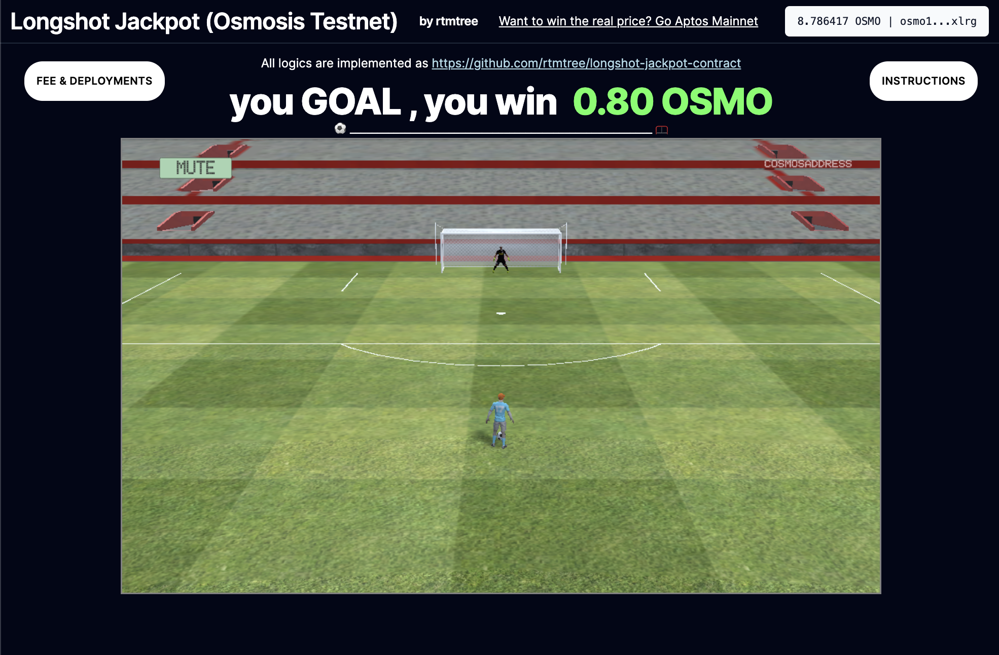

# Longshot Jackpot Smart Contract Cosmwasm
This is a smart contract for Longshot Jackpot, a Blockchain football game. The code is written in Rust programming language and designed for using in Osmosis, Neutron and other Cosmwasm supported chains.

  

This work is a Cosmwasm version of [Aptos Longshot Jackpot](https://github.com/rtmtree/longshot-jackpot-contract)

## Deployed DApp

[Osmosis Testnet](https://longshot-jackpot.vercel.app/?network=testnet)

## Deployed Smart Contract

**Osmosis Testnet**: 
[osmo1h3d6r0fp4p3wp3q9gqwumghrxwgzahh87jrqxznsjdzzkjs7du4q95f6hj](https://celatone.osmosis.zone/osmo-test-5/contracts/osmo1h3d6r0fp4p3wp3q9gqwumghrxwgzahh87jrqxznsjdzzkjs7du4q95f6hj)

**Neutron Mainnet**: 
Coming soon...

## 🎗Contributing
You can support this game to ENRICH the prize pool by donating \$OSMO, \$NTRN (depended on the network) to the contract address at 

**Osmosis Testnet**: 
[osmo1h3d6r0fp4p3wp3q9gqwumghrxwgzahh87jrqxznsjdzzkjs7du4q95f6hj](https://celatone.osmosis.zone/osmo-test-5/contracts/osmo1h3d6r0fp4p3wp3q9gqwumghrxwgzahh87jrqxznsjdzzkjs7du4q95f6hj)

**Neutron Mainnet**: 
Coming soon...